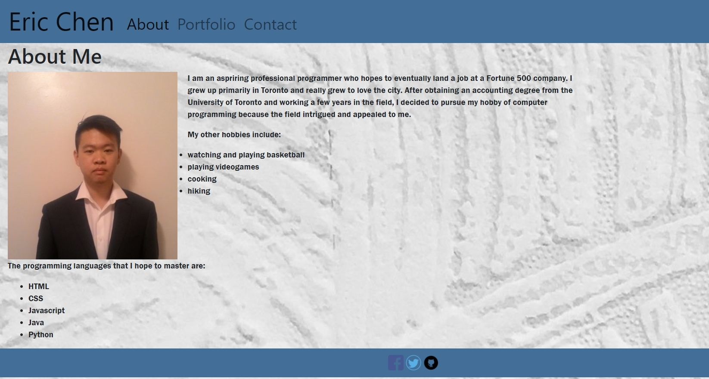
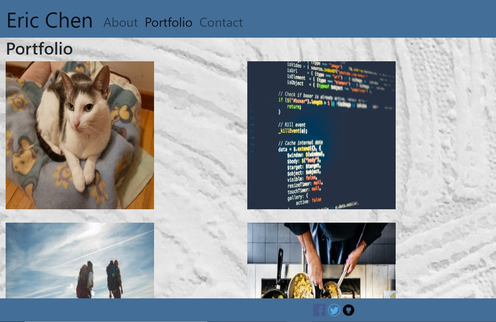
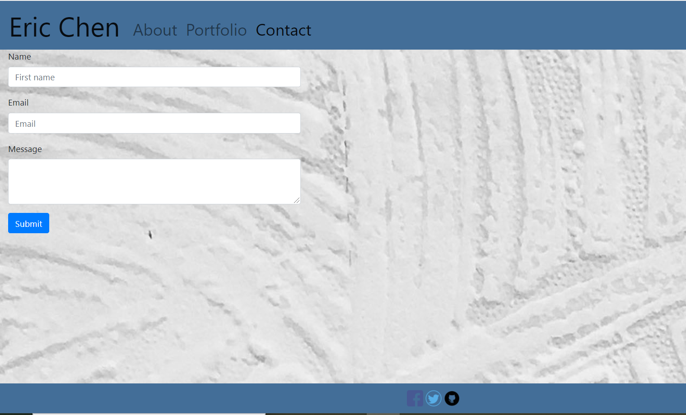

# Responsive Portfolio

[Link to site](https://ericchen96.github.io/Responsive_Portfolio/)  
[Link to Github repository](https://github.com/EricChen96/Responsive_Portfolio)

## Installation
Go to Github respository and download

## Usage
The following site is a profile page. It would contain an "About Me", "Portfolio", and "Contact Me" page.  
You can use the NavBar to change pages.

The page can also be resized and is mobile responsive.

The footer is a stick footer and contains links to social media sites. Only github icon links directly to my repository while my Facebook and Twitter are private so they would only link to homepage.

## Credits
Bootstrap
